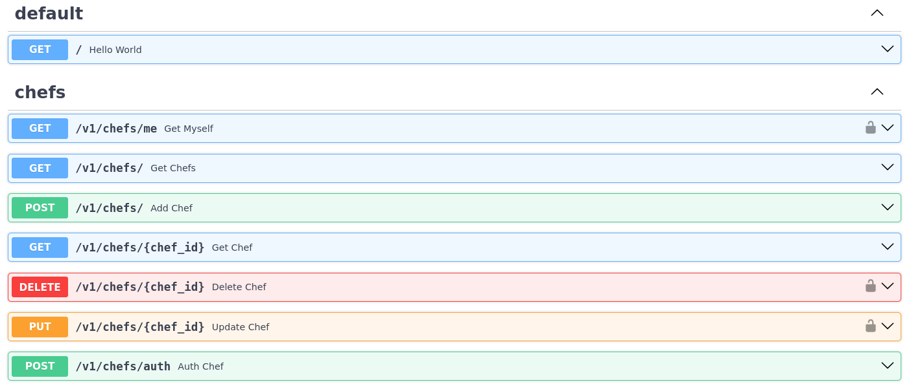
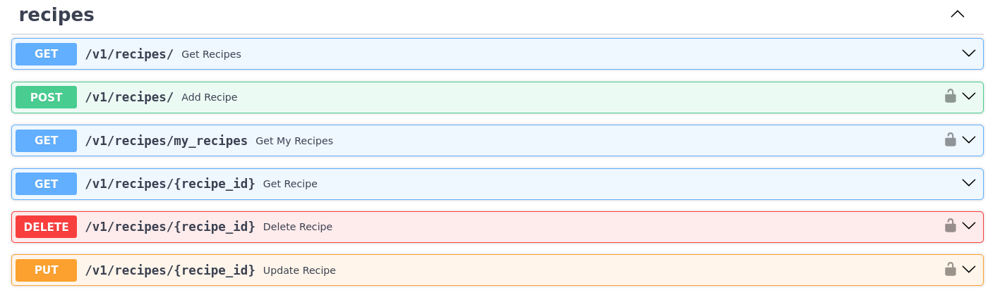

# Sistema de Compartilhamento de Receitas

Documentação geral da aplicação completa (frontend + backend + infraestrutura).

## Visão geral

A aplicação é uma plataforma de compartilhamento de receitas composta por dois módulos principais:

- **`server/`** — API REST em Python (FastAPI) responsável por autenticação de chefs, gerenciamento de receitas, upload de imagens, cache, paginação e rate limit.
- **`client/`** — Interface web em Python (Streamlit) que consome a API e oferece telas de listagem, cadastro, edição e exclusão de receitas, além de autenticação e gerenciamento de perfil do chef.

O fluxo principal é: um chef se cadastra, faz login e recebe um token JWT. Com esse token, ele pode criar, editar e excluir **apenas as próprias** receitas. Usuários não autenticados podem navegar e visualizar receitas e chefs publicamente.

## Interface da aplicação

A visão geral do projeto está abaixo, mas os detalhes de implementação ficam na documentação específica de cada camada.

### Galeria rápida

Para a documentação detalhada do frontend, consulte [client/README.md](client/README.md).
Para a documentação detalhada da API, consulte [server/README.md](server/README.md).