# Frontend — Streamlit

Este README detalha a camada de frontend da aplicação, responsável pela interação com o usuário, navegação, autenticação e renderização das receitas.

## Visão geral

O frontend foi construído com Streamlit e funciona como a interface do cliente para a API REST do backend. 

## Objetivo da camada

A camada frontend tem como responsabilidade:

- apresentar telas de navegação e conteúdo
- capturar dados do usuário em formulários
- autenticar via token JWT
- enviar requisições para a API
- exibir feedback de erro e mensagens de sucesso
- renderizar receitas com texto e imagem

## Tecnologias

- Python 3.13+
- Streamlit
- requests
- sessão do navegador via Streamlit state

## Estrutura do frontend

```text
client/
├── src/
│   ├── main.py
│   ├── api/
│   │   ├── chefs.py
│   │   └── recipes.py
│   ├── helpers/
│   │   └── ui.py
│   └── pages/
│       ├── auth/
│       │   ├── delete_account_page.py
│       │   ├── edit_profile_page.py
│       │   ├── login_page.py
│       │   ├── my_recipes_page.py
│       │   ├── profile_page.py
│       │   └── register_page.py
│       ├── chefs/
│       │   └── chef_page.py
│       └── recipes/
│           ├── create_recipe_page.py
│           ├── delete_recipe_page.py
│           ├── detail_recipe_page.py
│           ├── list_recipe_page.py
│           ├── my_recipes_page.py
│           ├── update_recipe_page.py
│           └── ...
├── pyproject.toml
├── README.md
└── tests/
```

## Fluxo principal da experiência

### 1. Usuário não autenticado

O sistema permite que o visitante:

- veja receitas públicas
- veja o perfil de chefs
- faça cadastro
- faça login

### 2. Usuário autenticado

Quando o token JWT é salvo na sessão, o sistema libera páginas exclusivas do chef:

- minhas receitas
- nova receita
- atualizar receita
- excluir receita
- meu perfil
- editar perfil
- excluir conta

## Navegação e organização

A interface usa navegação dinâmica, com páginas separadas por categoria:

- Receitas
  - públicas
  - detalhe
  - minhas receitas
  - nova receita
  - atualizar
  - excluir
- Chefs
  - listagem
  - detalhe
- Conta
  - cadastro
  - login
  - perfil
  - editar perfil
  - excluir conta

## Integração com a API

As chamadas HTTP estão encapsuladas em arquivos da pasta [client/src/api](src/api):

- [client/src/api/chefs.py](src/api/chefs.py)
- [client/src/api/recipes.py](src/api/recipes.py)

Esses módulos são responsáveis por:

- montar os endpoints da API
- incluir o cabeçalho Authorization quando necessário
- tratar mensagens de erro vindas do backend
- converter respostas em objetos prontos para renderização

## Estado da sessão

O frontend usa o estado da sessão do Streamlit para guardar:

- token JWT
- status de autenticação
- dados do chef autenticado
- lista de receitas carregadas

Esse estado é essencial para a navegação e para decidir quais páginas estão disponíveis em cada momento.

## Galeria de telas

### Fluxo principal

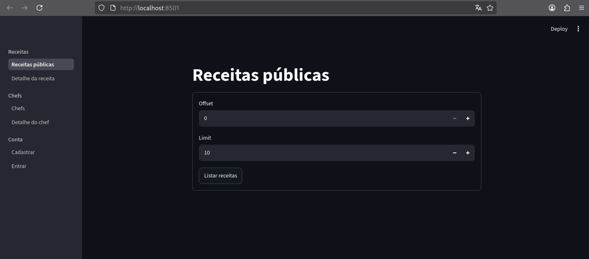
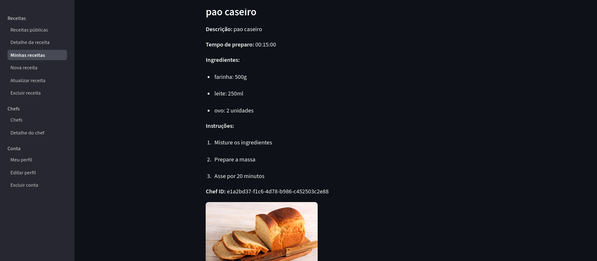
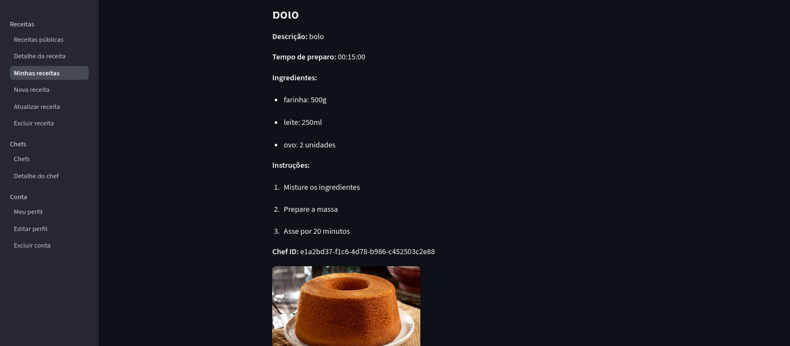

### Gestão de conta

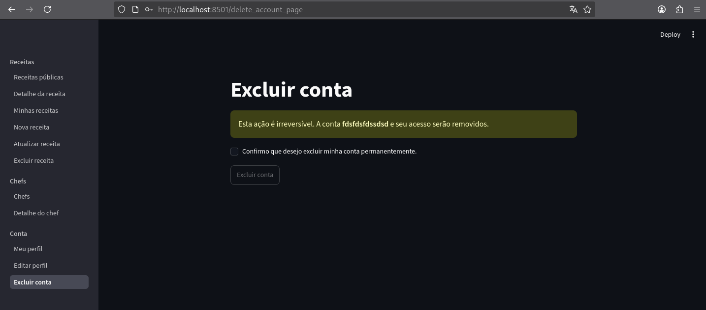
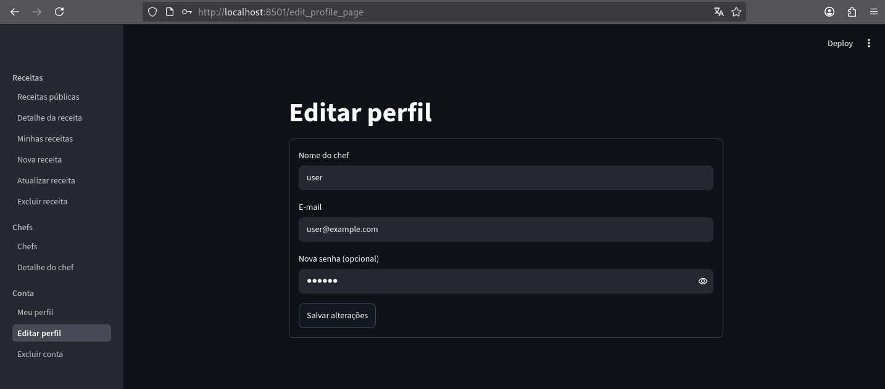

### Receitas

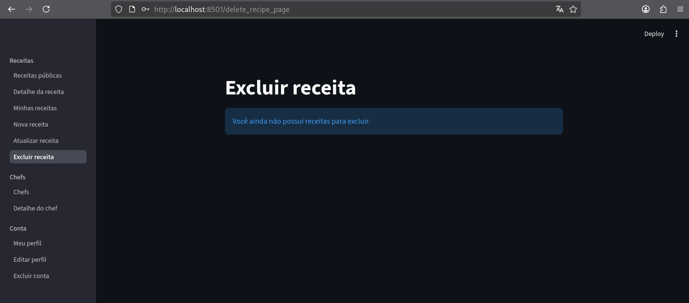
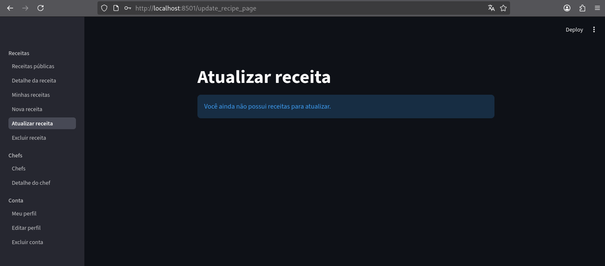
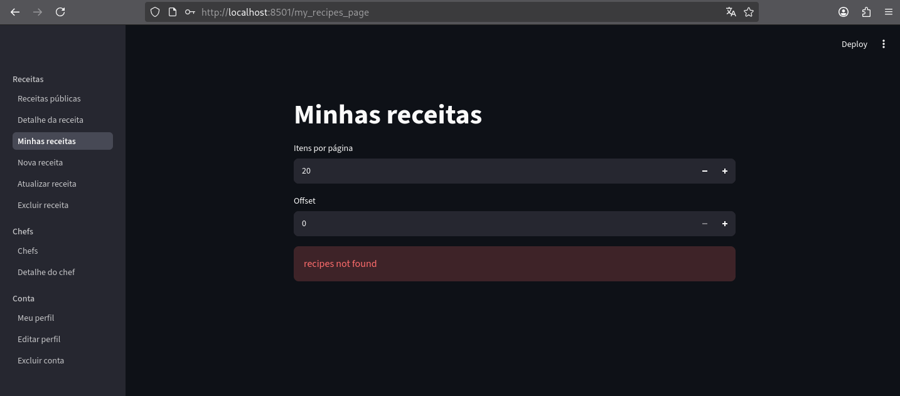

### Busca e operações

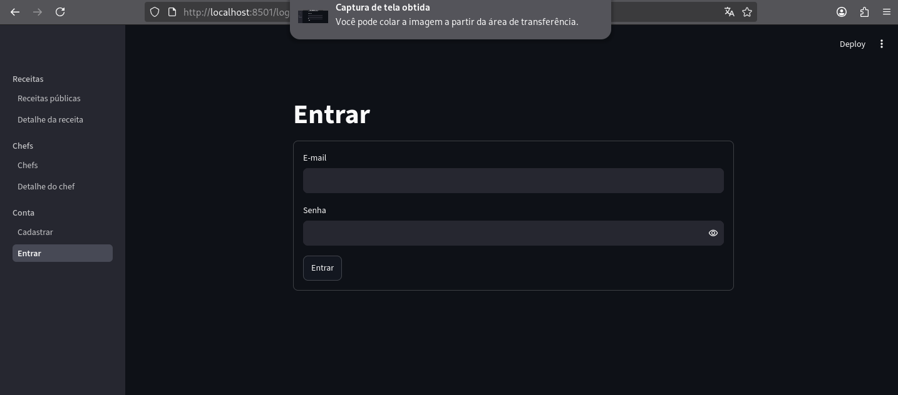
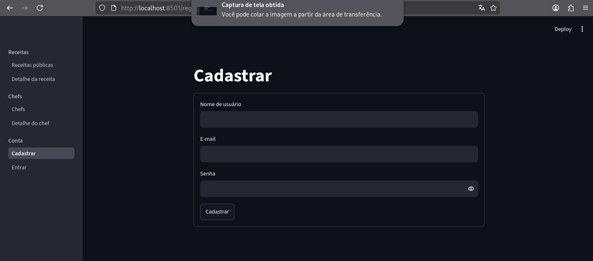
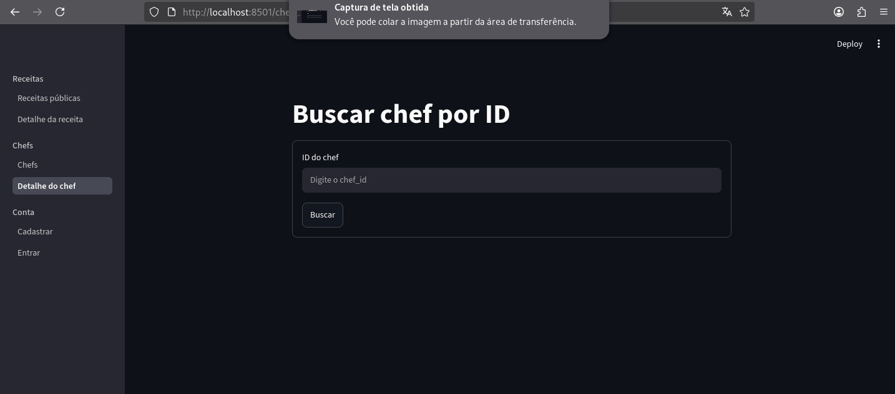
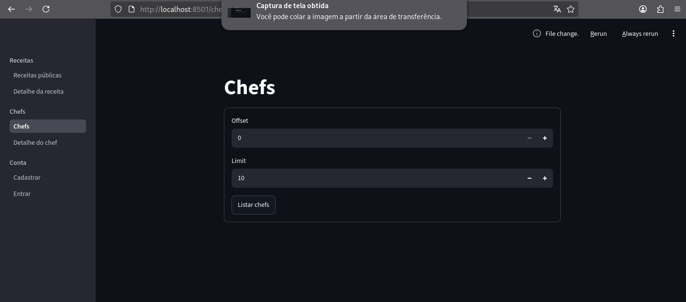
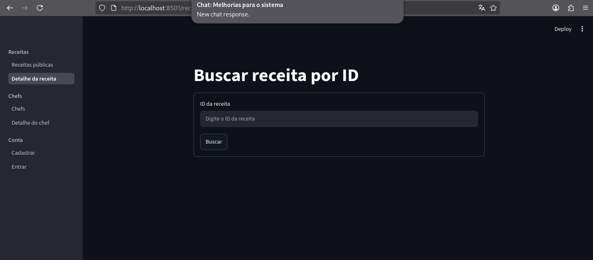

## Como executar o frontend

```bash
cd client
poetry install
poetry run streamlit run src/main.py
```

A aplicação fica acessível em:

- http://localhost:8501


